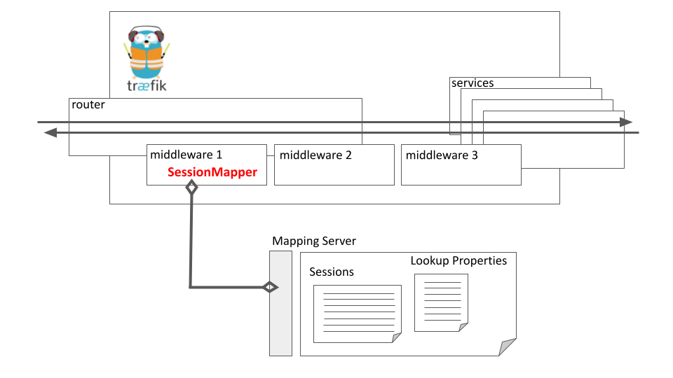

# Traefik SessionMapper

A Traefik middleware that maps users or sessions to with properties for
A/B tests, canari deployments, traces, security and anything you want. 

## Overview

Session Mapper is a simple middleware for Traefik that queries an API and
set additional headers before it runs upstream requests. The middleware can
be used in front of others. It allows advanced behaviors like setting a
headers for a session, a user or a group of users. Applications are endless.
The middleware requires you run a SessionMapper server as shown below:



## Configuration

You only need a few parameters to configure the middleware:

- `headers` lists the headers to capture from the request and send to the
  server (default: [`me`])
- `server` is the server URL (default: `http://localhost:7777/`)
- `timeout` is the delay in milliseconds before the request to the server
  fails and no headers are set to the upstream request.

## Implementing a SessionMapper Server

For now, the session Mapper is a simple HTTP server that should be
colocated to traefik, for instance as a sidecar. The middleware performs
a `POST` to the `server` URL. The return message would look like below:

```json
{"upstream": {
	"key1": "value1",
	"key2": "value2"
}}
```

The `server` directory that is part of the
[blaqkube/sessionmapper](http://github.com/blaqkube/sessionmapper) provides
a simple service that implements the current request/response protocol. Next
release will improve the protocol to reduce the latency and make it more
reliable, including blocking on failure. Do not hesitate to open an issue if
you repository find this plugin useful and want to support more advanced
scenarios.
